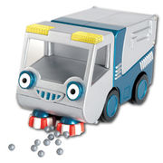

# Bristle

Bristle works closely on Git and closes Releases and Hotfixes by merging as described in GitFlow.

Releases and Hotfixes are merged to the master and develop branch. Furthermore the master-branch merge-commit 
is tagged with the version information. After a successfull merge, the intermediate Release or Hotfix branch is 
removed in order to have a clean repository afterwards.

Bristle is thought to be used on Teamcity, but is designed to do its proper work as well on the client side on a local 
Git-repository.

## Preconditions
In order to let Bristle do its nice cleanup stuff after all other members of the Bob-crew, you should be familiar
with Git repositories and the GitFlow and SemVer specification.

Bristle checks a lot on consistency and is not willing to work if only one little thing could be wrong. All these things
need to be fullfilled:
- Work is only possible in a Git repository. There is no possibility to provide one, you must sit on it.
- The current branch is a release or hotfix branch and the Head is not detached.
- There exists a develop branch (otherwise the repo is not following GitFlow).
- On no involved branches are local modifications and all are up to date.
- All involved branches have a remote branch on an origin repository.
- The Version does not exists yet as tag.
- the Version follows SemVer.

In all other cases, Bristle is snoobish and reverts all possibly happend actions done already. Nothing is pushed to the 
remote origin repository, and it's your own duty to reach the point Bristle is satisfied enough to start work again.